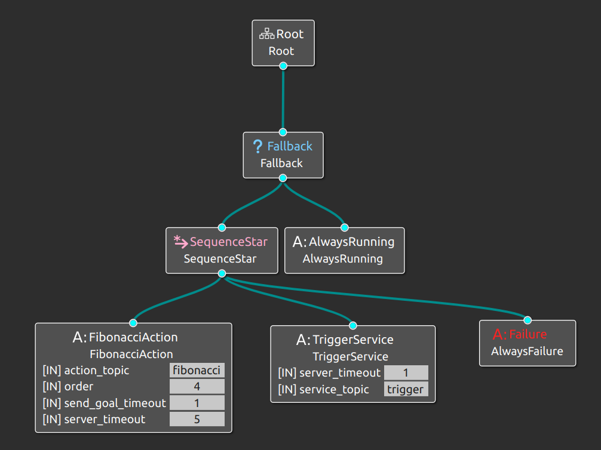
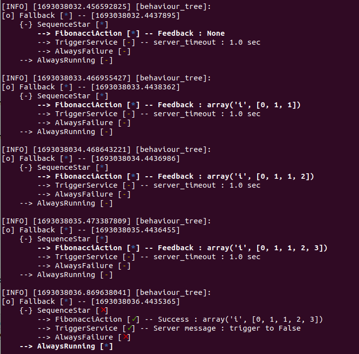

# BehaviourTree_RCLPY

[](https://opensource.org/licenses/MIT)
[](https://index.ros.org/doc/ros2/)
[](https://www.python.org/)

**BehaviourTree_RCLPY** is a project that aims to automate the creation of behavior trees using the PyTree library. The primary objective is to enable the use of the Groot interface, which currently supports only BehaviorTreeCpp, to seamlessly work with Python-based ROS 2 nodes via `rclpy`. The repository provides tools to generate behavior tree XML files from Groot and subsequently utilize these XML files to create `rclpy` nodes that can be run as ROS 2 nodes.

## Features

- Providing PyTree Behaviours supported in Groot Interface
- Providing `rclpy` **service_client** and **action_client** Behaviours that can operate in PyTree
- There are rclpy interface behaviours example in package **TriggerService** which is the client of Trigger.srv 
- Automatically convert behavior trees from BehaviorTreeCpp-compatible XML format to PyTree 
- Generate ROS 2 nodes from the converted XML behavior trees.

## Prerequisites

- Groot: Install the Groot behavior tree editor by following the instructions at [Groot's GitHub repository](https://github.com/BehaviorTree/Groot).
- ROS 2: Follow the [ROS 2 installation instructions](https://index.ros.org/doc/ros2/Installation/) to set up your environment.
- Python 3.6+: Make sure you have a compatible Python version installed.
- PyTree: Install the PyTree library, if not already installed, using the following command:
  ```shell
  pip3 install pyTree
  ```

## Installation

1. Clone this repository:
   ```shell
   mkdir your_ws/src
   cd your_ws/src
   git clone https://github.com/sorawit112/BehaviorTree_RCPLY
2. Build on your colcon workspace
   ```shell
   cd /path_to_your_ws
   colcon build --packages-select behaviour_tree_rclpy
   ```

# Examples

This is the example to run `rclpy` **Action_Cient** and **Service_Client** supported in behaviour tree
The example follow this behaviour tree which is explained in `resource/test_behaviour.xml`
 
The repository as a default is providing the example that you can run by follow this step (Don't forget to build behaviour_tree_rclpy package before following step)
1. Run Action_Server node by open new terminal
    ```shell
    open new terminal
    ros2 run examples_rclpy_minimal_action_server server_single_goal
    ```
2. Run Service_Server node by open new terminal
    ```shell
    open new terminal
    ros2 run behaviour_tree_rclpy mockup_tigger 
    ```
3. Run behaviour_tree node by open new terminal 
    ```shell
    open new terminal
    ros2 run behaviour_tree_rclpy bt_node 
    ```
    the output in this terminal should be something like this
       
# Usage

1. Import PyTree Behaviours to Groot
    > In Groot
    using Load Tree to import py_tree_nodes by select file **behaviour_tree_rclpy/resource/py_tree_nodes.xml**
    
    > If you're not familiar with pyTree, you can follow the [PyTree Tutorial](https://py-trees.readthedocs.io/en/devel/) to learn how to use pyTree. pyTree is backend library to operate behaviour tree in rclpy
2. Create Your Behaviours Tree in Groot 
    > If you're not familiar with Groot, you can follow the [Groot's Tutorial](https://github.com/BehaviorTree/Groot) to learn how to create behavior trees using the Groot interface. Groot is an essential part of this project, as it's used to design the behavior trees that will be converted and used with this repository.
3. Save Behaviours Tree in `resource` directory the output name should be like your_behavior_tree.xml
4. Add your_behaviour_tree.xml as a package data_files
   > in setup.py editing data_files by add your_behaviour_tree.xml should be something like this
   `('share/' + package_name, ['resource/your_behaviour_tree.xml'])`
   then build your package again your_behaviour_tree.xml should be in `install/share`directory
   This step will make your_behaviour_tree.xml can located by using get_package_share_directory function 
5. To run `Your Behaviours Tree` as a ROS2 node
   > in bt_node.py at main() editing xml_file name as your_behavior_tree.xml then build your package gain or if you build by --symlink-install before its not neccessory to build agian the edited code should be like this

   ```
   def main():
    rclpy.init()
    
    xml = get_package_share_directory('behaviour_tree_rclpy') + '/your_behaviour_tree.xml'
    node = BehaviourTreeNode(xml)
    try:
        rclpy.spin(node)
        
    except (KeyboardInterrupt, Exception) as e:
        print(e)
        node.destroy_node()
    finally:
        if rclpy.ok():
            rclpy.shutdown()
        else:
            print('\n\nrclpy already shutdown')
    ```
    in shell script using
    ```shell
    ros2 run behaviour_tree_rclpy bt_node
    ```

## Create new rclpy Behaviour

**The tutorial step not avaliable yet but try to follow this guiding.**
Create your own rclpy action_client or service_client behaviour by see the example of TriggerService for implementation, then don't forget to add your Behaviour in bt_factory and create new Groot Interface Block by adding `new custom nodes` that link with your own behaviour name.
# Collaboration

If you happen to come across any errors, please don't hesitate to either create a pull request or open an issue. Your assistance is highly appreciated, and I'll do my best to respond promptly. Thank you for your understanding and collaboration!

# License
This project is licensed under the MIT License - see the [LICENSE](https://opensource.org/licenses/MIT) file for details.

# Acknowledgments
The project was inspired by the need to bridge the gap between PyTree behavior trees and the Groot interface.
Special thanks to the ROS and BehaviorTree community for their valuable resources and tools.